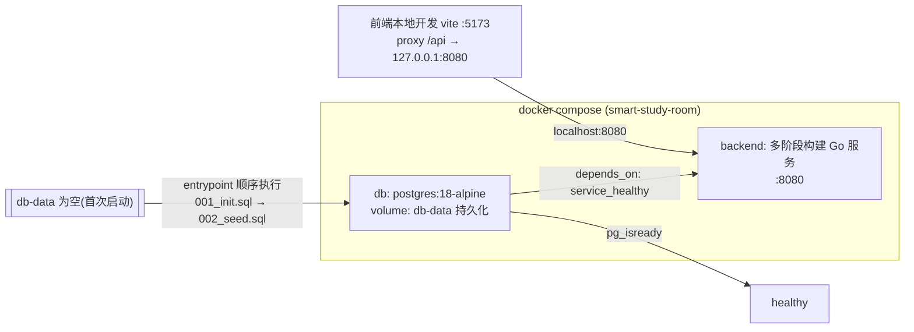

## 用户需求

为「智能共享自习室预约系统」的**后端（Go）与数据库（PostgreSQL）**加入 Docker 化启动能力，并实现数据库在 Docker 容器内的**全新初始化（数据迁移）**：

- 通过 `docker compose` 一键启动数据库与后端服务；
- 数据库容器**首次启动**时自动按序执行现有迁移脚本 `backend/migrations/001_init.sql`（建表/约束/索引）与种子数据 `backend/seed/seed.sql`（管理员 + 40 学生 + 自习室/座位 + 14 天历史预约），做到"起库即用"，无需手动执行迁移；
- 数据库数据持久化于 Docker named volume，支持一键重建后重新初始化；
- **仅后端 + 数据库** Docker 化，前端保持本地 `npm run dev` 开发方式不变（当前为 Windows + Docker Desktop 本地开发环境，操作以 `docker compose` 命令为准，不引入依赖 WSL 的新脚本）；
- 现有本地用户级集群管理脚本（`scripts/*.sh`）与后端 Go 代码、SQL 迁移内容均保持不动。

## 核心功能

- 新增后端多阶段构建 `Dockerfile`（Go 1.27 构建 → 精简运行镜像）；
- 新增根目录 `docker-compose.yml`：编排 `db`（postgres:18）+ `backend` 两个服务，含健康检查、启动顺序依赖、数据卷与端口映射；
- 数据库自动初始化：利用 postgres 官方镜像 `/docker-entrypoint-initdb.d/` 机制，将迁移与种子 SQL 以单文件挂载方式按序执行；
- 配置通过环境变量注入（复用后端现有 `STUDYROOM_PORT` / `STUDYROOM_DB_URL` / `STUDYROOM_JWT_SECRET`），不改任何 Go 代码；
- README「快速开始」补充 Docker 启动、验证与重置（`down -v` 重新初始化）说明。

## 技术选型

- **容器编排**：Docker Compose v2（`docker compose` 子命令，Windows Docker Desktop 原生支持，无需 WSL）
- **数据库镜像**：`postgres:18-alpine`（与项目 PostgreSQL 18 一致；官方镜像自带 contrib，可执行 `CREATE EXTENSION btree_gist`；超级用户 `postgres` 执行 initdb 脚本）
- **后端镜像**：Go 1.27（与 `go.mod`、CI `actions/setup-go@v5 go-version: "1.27"` 一致）多阶段构建
- **配置注入**：后端 `config.Load()` 只读三个环境变量，pgx 同时支持 DSN 与 URL；Docker 内只需注入 URL 形式 `STUDYROOM_DB_URL`，**后端源码零改动**

## 实现思路与关键技术决策

1. **数据库"迁移 = 容器内全新初始化"机制**：postgres 官方镜像仅在数据目录为空（named volume 首次挂载）时，按文件名字典序执行 `/docker-entrypoint-initdb.d/` 下的 `*.sql`。将两个 SQL 以**单文件 bind mount**（只读）方式挂入，天然保证顺序：`001_init.sql`（建 schema）→ `002_seed.sql`（种子数据），且不改动、不复制仓库中的 SQL 源文件。
2. **启动顺序**：`db` 服务配置 `pg_isready` healthcheck（`pg_isready` 需等 initdb 脚本全部完成后才可连通，间接保证迁移完成）；`backend` 使用 `depends_on: db: condition: service_healthy`，避免后端启动时库未就绪。
3. **配置与密钥**：`POSTGRES_USER/PASSWORD/DB` 与 `STUDYROOM_JWT_SECRET` 支持通过根目录 `.env` 覆盖，提供安全默认值（studyroom / studyroom-dev-secret）；`.env` 已被根 `.gitignore` 忽略，故新增可提交的 `.env.example` 作为模板。
4. **端口策略**：后端映射 `8080:8080`（与前端 Vite 代理 `http://127.0.0.1:8080` 衔接，本地 `npm run dev` 即可直连容器内后端）；数据库映射 **`5433:5432`**——规避本机既有用户级集群（`scripts/*.sh` 默认占 5432）的端口冲突，README 中说明可用 `localhost:5433` 直连调试。
5. **持久化与重置**：`db-data` named volume 保存数据；schema/种子变更后执行 `docker compose down -v` 删除卷，下次 `up` 即自动重新初始化。
6. **后端镜像**：多阶段构建减小体积并避免将源码/工具链带入运行镜像；`CGO_ENABLED=0` 静态编译（pgx/Gin 纯 Go，无 libpq 依赖），运行阶段 `alpine` + `ca-certificates` + `tzdata`（调度器依赖系统时区语义正确）。

## 架构设计

服务拓扑与首次启动数据流如下：



## 实施注意事项

- initdb 挂载路径使用正斜杠与相对路径（`./backend/...`），Windows 下 Docker Desktop 兼容；两个 SQL 挂载名加 `:ro` 防止误改。
- `docker-entrypoint-initdb.d` **只在空数据卷首次启动执行**——这是预期行为，重置需 `down -v`；seed.sql 本身含 `TRUNCATE ... RESTART IDENTITY` 可重复执行，天然安全。
- healthcheck 中 `${POSTGRES_USER}` 需双美元符转义，由容器内环境变量展开，避免被 compose 提前插值。
- 不改动 `backend/migrations/`、`backend/seed/`、`scripts/` 与任何 `.go` 文件；`.dockerignore` 必须排除 `*.log`、`*.exe`（仓库内已有 `server_run.log`/`server_err.log`/`server.exe`，避免污染构建上下文）。
- 首次 `docker compose up` 需拉取基础镜像，耗时较长属正常；验证点：`docker compose ps` 双服务 healthy、`docker compose logs backend` 出现监听日志、`admin/admin123` 可登录。

## 目录结构

```
project-root/
├── docker-compose.yml    # [NEW] 编排 db + backend。db: postgres:18-alpine、POSTGRES_USER/PASSWORD/DB 环境变量、5433:5432、db-data 卷、initdb SQL 挂载、pg_isready 健康检查；backend: build ./backend、8080:8080、注入 STUDYROOM_PORT/DB_URL/JWT_SECRET、depends_on 健康条件、restart 策略。
├── .env.example          # [NEW] 环境变量模板：POSTGRES_USER/POSTGRES_PASSWORD/POSTGRES_DB/STUDYROOM_JWT_SECRET 及其默认值说明（.env 已被 gitignore）。
├── backend/
│   ├── Dockerfile        # [NEW] 多阶段构建：golang:1.27-alpine 阶段 go mod download + CGO_ENABLED=0 编译 ./cmd/server；alpine:3.21 运行阶段安装 ca-certificates/tzdata，COPY 二进制，EXPOSE 8080，ENTRYPOINT。
│   └── .dockerignore     # [NEW] 排除 .git、*.log、*.exe、bin/ 等，缩小构建上下文。
└── README.md             # [MODIFY] 「快速开始」新增「Docker 启动」小节：前置条件(Docker Desktop)、docker compose up -d --build、日志查看、健康验证、端口说明(8080 后端/5433 数据库直连)、重置重新初始化(down -v)与本地开发联调说明。
```

## 关键结构

`docker-compose.yml` 编排契约（接线细节须精确，防止启动顺序与初始化失效）：

```
name: smart-study-room

services:
  db:
    image: postgres:18-alpine
    container_name: studyroom-db
    environment:
      POSTGRES_USER: ${POSTGRES_USER:-studyroom}
      POSTGRES_PASSWORD: ${POSTGRES_PASSWORD:-studyroom}
      POSTGRES_DB: ${POSTGRES_DB:-studyroom}
    ports:
      - "5433:5432"
    volumes:
      - db-data:/var/lib/postgresql/data
      - ./backend/migrations/001_init.sql:/docker-entrypoint-initdb.d/001_init.sql:ro
      - ./backend/seed/seed.sql:/docker-entrypoint-initdb.d/002_seed.sql:ro
    healthcheck:
      test: ["CMD-SHELL", "pg_isready -U $${POSTGRES_USER} -d $${POSTGRES_DB}"]
      interval: 5s
      timeout: 5s
      retries: 12
    restart: unless-stopped

  backend:
    build:
      context: ./backend
      dockerfile: Dockerfile
    container_name: studyroom-backend
    environment:
      STUDYROOM_PORT: "8080"
      STUDYROOM_DB_URL: postgres://${POSTGRES_USER:-studyroom}:${POSTGRES_PASSWORD:-studyroom}@db:5432/${POSTGRES_DB:-studyroom}?sslmode=disable
      STUDYROOM_JWT_SECRET: ${STUDYROOM_JWT_SECRET:-studyroom-dev-secret}
    ports:
      - "8080:8080"
    depends_on:
      db:
        condition: service_healthy
    restart: unless-stopped

volumes:
  db-data:
```

后端 `Dockerfile` 关键阶段（多阶段、静态编译）：

```
FROM golang:1.27-alpine AS build
WORKDIR /src
COPY go.mod go.sum ./
RUN go mod download
COPY . .
RUN CGO_ENABLED=0 go build -trimpath -ldflags="-s -w" -o /out/server ./cmd/server

FROM alpine:3.21
RUN apk add --no-cache ca-certificates tzdata
COPY --from=build /out/server /usr/local/bin/server
EXPOSE 8080
ENTRYPOINT ["server"]
```